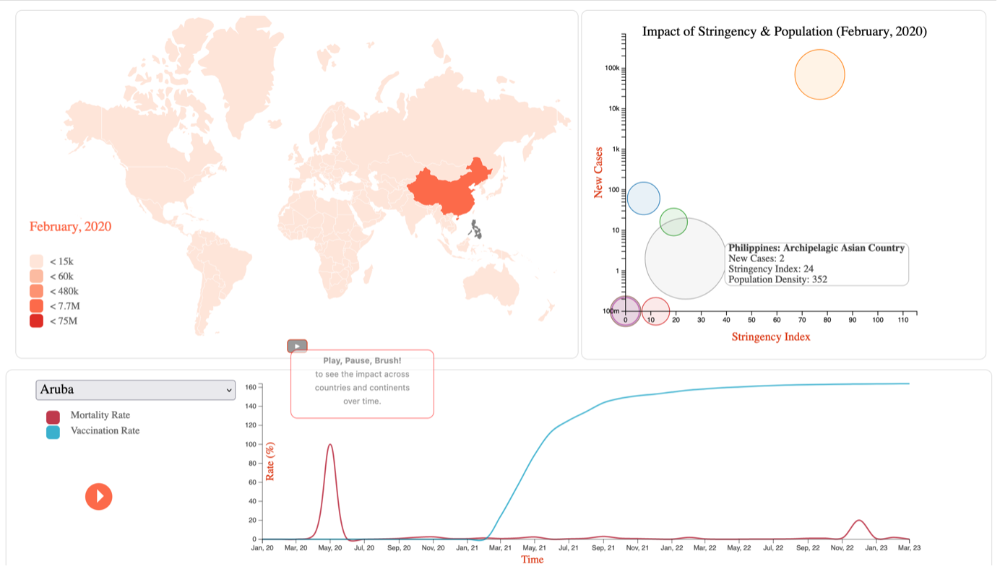
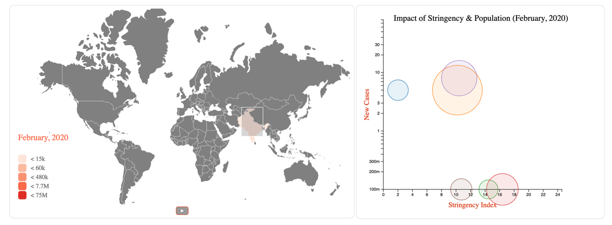
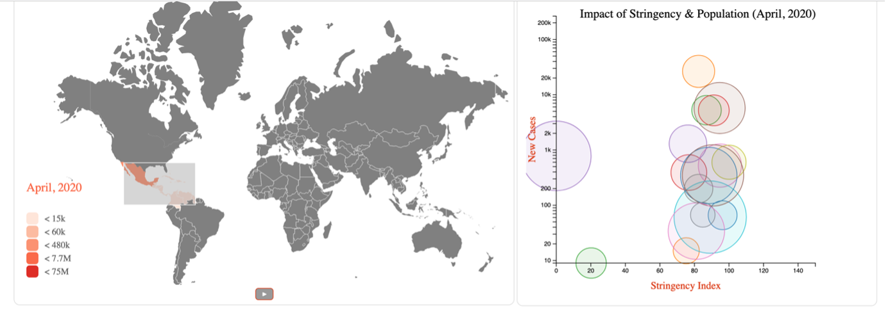
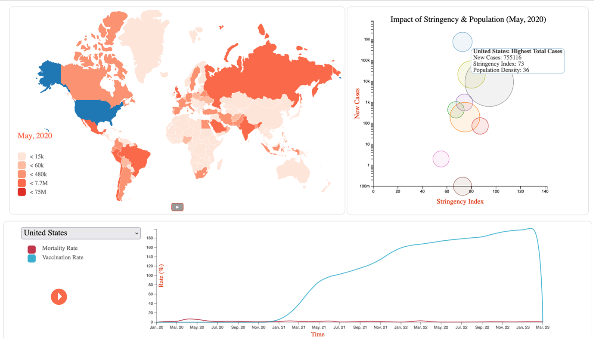

# COVID-19 – A Proportionate or Disproportionate Impact on the World

### **Please ensure that you cite this repository if you use any of its code.**

## Overview

During the COVID-19 pandemic core period between February 2020 and February 2023, countries across the world were hit very differently due to varying social, economic, and environmental factors. This project approaches the data from this perspective.

### Story

**Title:** COVID-19 – A Proportionate or Disproportionate Impact on the World.

Based on key parameters such as population density, stringency index, vaccination rate, and GDP per capita, the visualizations aim to depict the severity of the pandemic in various countries in terms of:
- Number of new cases per month
- Mortality rate (calculated as number of new deaths per million / number of new cases per million * 100)
- Total deaths per million
- New cases per million

From these visualizations, users can draw conclusions about whether the varying factors of each country influenced the severity of the outbreak and how well it was controlled.

### Data

The data used is from the [Our World in Data COVID-19 dataset](https://github.com/owid/covid-19-data/blob/master/public/data/owid-covid-data.csv). The data is available for nearly every day during the COVID-19 core period. This project focuses on monthly changes and therefore, the dataset was pre-processed to aggregate the values for each month before loading it into the code. The extraction file is included in the `code/resources` directory of the project.

### Visualizations

The project includes three main visualizations and two supporting visualizations:

#### Main Visualizations

1. **Time Series Map**
   - Depicts the COVID-19 spread for every month from February 2020 to February 2023 on a world map.
   - Reference: Bostock, 2012

2. **Bubble Chart**
   - Shows the number of new cases against the stringency index, with bubble sizes representing population density and colors representing different countries.

3. **Line Plot**
   - Compares the mortality rate and vaccination rate for each country selected from a dropdown menu for the entire COVID period.
   - References: Mathieu, 2022, COVID-19

#### Supporting Visualizations

1. **Heat Map**
   - Compares GDP per capita with total deaths per million and new cases per million.

2. **Scatter Plot**
   - Created using the result of clustering countries based on selected parameters and the number of new cases per million.

### Browser Compatibility

The code was tested on Firefox, Safari, and Chrome and functions correctly on all three. Note: Chrome has a small glitch on the introduction page when the page is refreshed.

## Details of Visualizations and Task Achievement

### Main Tasks

**Narrate the timeline of the COVID-19 pandemic around the world, and the effect the vaccines had on the scale of the outbreak.** This task is achieved with the following visualizations:

#### How did the COVID-19 pandemic grow over countries and continents throughout the world from its start?

**Time Series Map**
- This task is illustrated by the heat map depicted on the world map, showing the wave of COVID-19 in terms of the number of new cases per month.
- Code reference: Gallery, 2018
- The legend indicates the severity in terms of the number of new cases, with lighter shades indicating fewer cases and darker shades indicating more cases.
- The map has a play button to start viewing the time series data.
- Users can use the brushing tool to select the area of interest and compare the data of included countries on the automatically updated bubble chart and line plot.

**Reasoning:** Maps are familiar to most people and make it easier to understand the severity of cases in countries and continents compared to a bar chart. A time series with a play button interface simplifies navigation, and brushing allows users to narrow down to specific countries.

#### Choosing some specific countries, how successfully did they manage the outbreak?

**Bubble Chart**
- Compares the stringency index against the number of new cases, considering the population density of each country.
- The period on the bubble chart is synchronized with the map.
- Clickable bubbles update the line plot for the specific country.

**Reasoning:** The bubble chart provides a clear, easy-to-understand interface for comparing the stringency index and population density, with colors distinguishing different countries.

#### What effect did vaccinations have on the spread of cases/deaths? Did booster jabs also have an impact on the spread/transmissibility of the virus?

**Line Plot**
- Compares the mortality rate and vaccination rate.
- Users can choose a country from the dropdown or click the country bubbles from the bubble chart.
- Shows data for the entire COVID period, allowing comparison of the mortality rate before and after vaccinations began.

**Reasoning:** A line plot effectively compares two parameters simultaneously, making it easy to grasp the effect of vaccinations.

## Features

- **Axes Rescaling and Update:** When the data of a single visualization is updated, all axes of that visualization also update/rescale accordingly. This feature has been implemented for all charts on the web page.

  
  
  

- **Linked Highlighting:** Mousing over a datapoint in one visualization highlights multiple associated datapoints in another visualization.
  
  

- Inclusion of a faceted selection interaction between two visualizations, where a mouseover or a click in one visualization results in the data of a different visualization being filtered:
  - Brushing tool over the map results in bubble chart update.
  - Clicking a country bubble results in line chart update.

- **Bubble Chart Design:** Circles of different sizes indicate population density scale in the bubble chart. The map uses a color scheme indicated by the legend to show the distribution of scale.

## Other Design Choices

- **Map Projection:** GeoMercator projection is used for the map because it is the projection most people are familiar with. Despite the difference in scale between the real sizes of countries and their size on the projection, it helps users connect better with the map, the countries, and continents.

- **Bubble Chart Tooltip:** The bubble chart supporting tooltip text provides additional information instead of a legend.

- **Additional Pages:** The application contains three additional pages to add continuity and provide a rest cycle between two graph sections. These pages are designed to benefit users from a non-technical background by offering summary text to help process the data and prepare for the next section.
  - **Initial Introduction Page:** Sets the context for the visualizations with a title, brief guiding text, and a navigation button.
  - **Static Summary Page:** Depicts the situation of COVID-19 across continents and introduces the next section.
  - **Conclusions Page:** Provides a smooth transition to the end of the web page, supporting the coursework objectives without biasing users.

## Testing and Debugging
  - Used `$0__data__` and `console.log` messages for debugging.
  - Tested the visualization with different inputs and combinations.
  - Tested on Firefox, Safari, and Chrome browsers.
